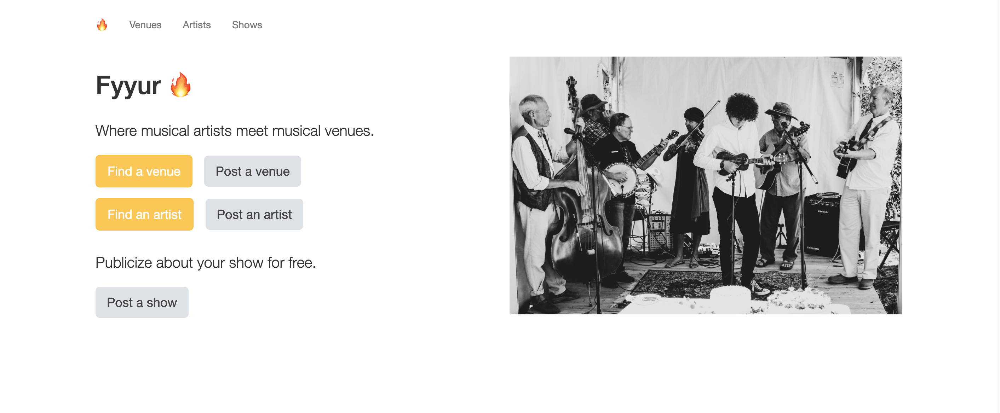

Fyyur
-----



Built as part of the Udacity Full Stack Web Developer nanodegree program. See ORIGINAL_README.md for the original README and installation notes.

Fyyur is a musical venue and artist booking site that facilitates the discovery and bookings of shows between local performing artists and venues. This site lets you list new artists and venues, discover them, and list shows with artists as a venue owner.

# Setup:

**Initialize and activate a virtualenv using:**
```
python -m venv venv
source venv/bin/activate
```
>**Note** - In Windows, the `env` does not have a `bin` directory. Therefore, you'd use the analogous command shown below:
```
source env/Scripts/activate
```

**Install the dependencies:**
```
pip install -r requirements.txt
```

**Run the development server:**
```
export FLASK_APP=myapp
export FLASK_ENV=development # enables debug mode
python3 app.py
```